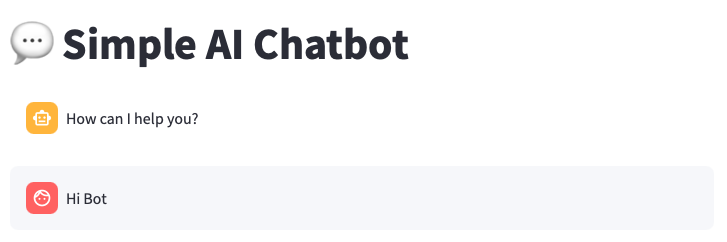
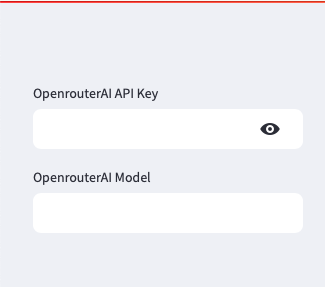

# Streamlit-Openrouter-App
Basic application showcasing my skill with creation of simple AI chat interface using Openrouter.ai API.

Using Openrouter api and streamlit created a simple chat interface allowing the user to chat with the any AI provided by the Openrouter.ai website,
This might require you to bring your own API Key from Openrouter website.

**Expected Outcome**: Building a simple AI Chatbot connecting the Openrouter.ai API Interface with Streamlit as frontend.

Possibilities for growth:
- Building a personal assistant
- Building a emotional supporting partner with AI
- Building a academic supporting partner for your upcoming assignments
- And more possibile application...

# Setting Up Guide
Recommended using Python 3.13.x used for deploying and working without any issues.

_Using a Virtual Environment is highly recommended to avoiding conflict with other packages on system_

Once you installed python run the following pip install commands to install all the necessary packages.

`pip install streamlit requests`

Finally to run the app you wanted to run the following command:

`streamlit run app/main.py`
ßß
# Usage Instruction
Input your API Key and Model ID from the Openrouter API website (May require some credits in your account if you plan on using paid models)

# Examples Output

